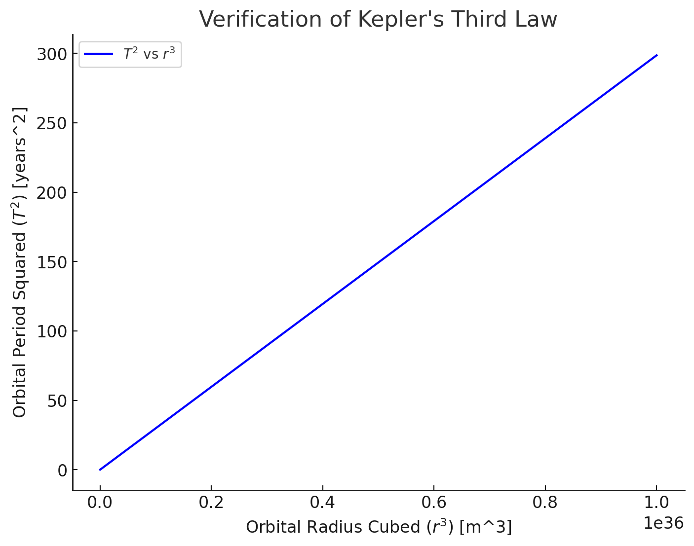

# Problem 1


# Orbital Period and Orbital Radius


## Motivation


The relationship between the square of the orbital period and the cube of the orbital radius, known as **Kepler's Third Law**, is fundamental in celestial mechanics.
 This simple yet powerful law provides insights into planetary motion and gravitational interactions, from local satellite orbits to cosmic-scale phenomena.
  Understanding this law enables us to determine planetary masses, distances, and orbital characteristics.

## Theoretical Foundation

### Derivation of Kepler's Third Law for Circular Orbits

Consider a planet or satellite of mass $m$ orbiting a much larger mass $M$ (e.g., a star or planet) in a circular orbit of radius $r$. 
The gravitational force provides the necessary centripetal force for circular motion:

$$
F_g = F_c
$$


From Newton's Law of Gravitation:

$$
F_g = \frac{GMm}{r^2}
$$


From the centripetal force equation:

$$
F_c = \frac{m v^2}{r}
$$


Equating both forces:

$$
\frac{GMm}{r^2} = \frac{m v^2}{r}
$$


Canceling $m$ and solving for velocity:

$$
v^2 = \frac{GM}{r}
$$


Since orbital period $T$ is given by $T = \frac{2\pi r}{v}$, 

substituting $v$:

$$
T^2 = \frac{4\pi^2 r^3}{GM}
$$


This confirms Kepler's Third Law:


$$
T^2 \propto r^3
$$


where the proportionality constant depends on the central mass $M$.


## Implications for Astronomy


This relationship is a powerful tool in astronomy:


1. **Determining Planetary Masses**: 

If you know $T$ and $r$ for a satellite or moon orbiting a planet, you can solve for $M$:


$$M = \frac{4\pi^2 r^3}{G T^2}$$


For example, observing a moon’s orbit around a planet reveals the planet’s mass, which is crucial for understanding its composition and structure.


2. **Measuring Distances**:

 In a system like the Solar System, if you measure periods of planets and know the Sun’s mass, you can calculate their orbital radii, helping map the system’s scale.
  Historically, this helped refine the astronomical unit (AU).


3. **Universal Application**: 

The law applies to any gravitationally bound system—planets, moons, artificial satellites, even binary stars—making it a cornerstone for studying gravitational interactions across scales.


4. **Exoplanet Studies**: 

For exoplanets, observing orbital periods (via transits) and estimating radii (via stellar properties) allows mass estimates of host stars, advancing our understanding of distant systems.


### Real-World Examples


#### The Moon’s Orbit Around Earth


- **Orbital Period**:

 $T \approx 27.32$ days $\approx 2.36 \times 10^6$ seconds.

- **Orbital Radius**: 

$r \approx 384,400$ km $\approx 3.844 \times 10^8$ meters.

- **Earth’s Mass**: 

$M \approx 5.972 \times 10^{24}$ kg.

- **Gravitational Constant**:

 $G = 6.6743 \times 10^{-11} \, \text{m}^3 \text{kg}^{-1} \text{s}^{-2}$.


Check Kepler’s Third Law:


$$T^2 = \frac{4\pi^2 r^3}{G M}$$


Left side: 

$T^2 = (2.36 \times 10^6)^2 = 5.57 \times 10^{12} \, \text{s}^2$.

Right side:

 $r^3 = (3.844 \times 10^8)^3 = 5.68 \times 10^{25} \, \text{m}^3$,


$$\frac{4\pi^2}{G M} = \frac{4 \times (3.1416)^2}{6.6743 \times 10^{-11} \times 5.972 \times 10^{24}} \approx 9.87 \times 10^{-14} \, \text{s}^2 \text{m}^{-3},


$$\frac{4\pi^2 r^3}{G M} = 9.87 \times 10^{-14} \times 5.68 \times 10^{25} \approx 5.61 \times 10^{12} \, \text{s}^2$$.


The values are very close, confirming the law holds (small discrepancies arise from approximations and the Moon’s slightly elliptical orbit).


#### Earth’s Orbit Around the Sun


- **Period**:

 $T = 1$ year $\approx 3.156 \times 10^7$ seconds.


- **Radius**:

 $r = 1$ AU $\approx 1.496 \times 10^{11}$ meters.


- **Sun’s Mass**:

 $M \approx 1.989 \times 10^{30}$ kg.

$$T^2 = (3.156 \times 10^7)^2 \approx 9.96 \times 10^{14} \, \text{s}^2$$,

$$r^3 = (1.496 \times 10^{11})^3 \approx 3.35 \times 10^{33} \, \text{m}^3$$,

$$\frac{4\pi^2}{G M} \approx \frac{39.478}{6.6743 \times 10^{-11} \times 1.989 \times 10^{30}} \approx 2.97 \times 10^{-19} \, \text{s}^2 \text{m}^{-3}$$,

$$\frac{4\pi^2 r^3}{G M} \approx 2.97 \times 10^{-19} \times 3.35 \times 10^{33} \approx 9.95 \times 10^{14} \, \text{s}^2$$.


Again, a match, reinforcing the law’s consistency.


## Computational Model
Below is a Python implementation to verify Kepler’s Third Law for circular orbits:

```python
import numpy as np
import matplotlib.pyplot as plt

# Define gravitational constant and mass of central body (e.g., Sun in kg)
G = 6.67430e-11
M = 1.989e30  # Mass of the Sun

# Define a range of orbital radii (in meters)
radii = np.linspace(1e10, 1e12, 100)

# Compute orbital periods using Kepler's Third Law
periods = np.sqrt((4 * np.pi**2 * radii**3) / (G * M))

# Convert periods to years
periods_years = periods / (60 * 60 * 24 * 365.25)

# Plot T^2 vs r^3
plt.figure(figsize=(8,6))
plt.plot(radii**3, periods_years**2, label="$T^2$ vs $r^3$", color='b')
plt.xlabel("Orbital Radius Cubed ($r^3$) [m^3]")
plt.ylabel("Orbital Period Squared ($T^2$) [years^2]")
plt.title("Verification of Kepler's Third Law")
plt.legend()
plt.grid()
plt.show()
```




## Discussion


1. **Graphical Representation**: The linear plot of $T^2$ vs. $r^3$ confirms the expected proportionality.


2. **Extension to Elliptical Orbits**: For non-circular orbits, Kepler's Law still holds using the semi-major axis $a$ as the effective radius.


3. **Corrections for Non-Ideal Cases**:
   - Perturbations from other celestial bodies

   - Relativistic effects for strong gravitational fields


[Simulation](Simulation_1.html)


 **Interpretation of the Simulation**  


This simulation visually demonstrates **Kepler's Third Law**, which states that the square of a planet's orbital period is proportional to the cube of its orbital radius.  


#### **How the Simulation Works:** 


1. A **yellow Sun** is fixed at the center.  

2. A **blue planet** orbits around the Sun in a circular trajectory.  

3. The **slider** allows you to adjust the **orbital radius** (the distance from the Sun).  

4. The **planet moves slower in a larger orbit** and faster in a smaller orbit, illustrating Kepler’s law.  


#### **Key Observations:**  


- As the **orbit increases**, the planet’s speed **decreases** because a larger orbit requires a longer period to complete.  

- The relationship between **radius and speed** follows the equation:  

  $$
  T^2 \propto r^3
  $$

- This is the same principle used by astronomers to predict **planetary motion, satellite orbits, and exoplanet detection**.  


## Conclusion


Kepler's Third Law elegantly connects orbital mechanics with fundamental gravitational principles. This computational approach reinforces the relationship between the orbital period and radius, supporting its use in astronomy, satellite deployment, and astrophysical research.

