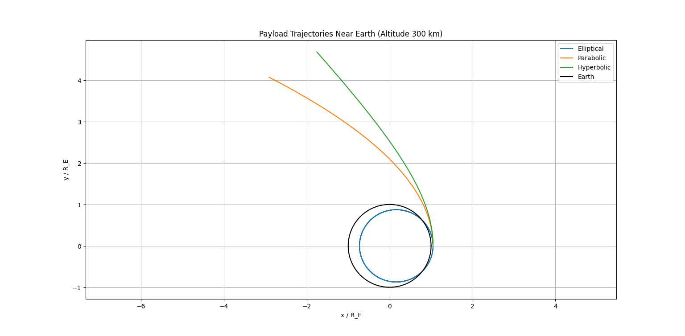

# Problem 3

# Trajectories of a Freely Released Payload Near Earth


### Step 1: Analyze Possible Trajectories

The trajectory of a payload released near Earth depends on its **specific mechanical energy**, which determines the type of orbit: elliptical, parabolic, or hyperbolic. The motion is governed by **Newton’s Law of Gravitation** and can be analyzed using **Kepler’s Laws**.

#### **Governing Equations**

- **Gravitational Force**: 

The force on the payload due to Earth’s gravity is:

  $$
  \mathbf{F} = -\frac{G M m}{r^3} \mathbf{r}
  $$


  where $G = 6.6743 \times 10^{-11} \, \text{m}^3 \text{kg}^{-1} \text{s}^{-2}$, $M = 5.972 \times 10^{24} \, \text{kg}$ (Earth’s mass), $m$ is the payload’s mass, $r = |\mathbf{r}|$ is the distance from Earth’s center, and $\mathbf{r}$ is the position vector.

- **Equation of Motion**:


  $$
  \mathbf{\ddot{r}} = -\frac{\mu}{r^3} \mathbf{r}
  $$
  where $\mu = G M \approx 3.986 \times 10^{14} \, \text{m}^3 \text{s}^{-2}$ (Earth’s gravitational parameter).

#### **Specific Mechanical Energy**

The specific energy ($\epsilon$) is:


$$
\epsilon = \frac{v^2}{2} - \frac{\mu}{r}
$$


where $v$ is the speed, and $r$ is the distance from Earth’s center.

- **Elliptical Orbit ($\epsilon < 0$)**: The payload is bound to Earth, following a closed elliptical path (e.g., a satellite in orbit).
- **Parabolic Trajectory ($\epsilon = 0$)**: The payload escapes to infinity with zero speed at infinity (escape velocity).
- **Hyperbolic Trajectory ($\epsilon > 0$)**: The payload escapes Earth’s gravity with excess speed, following an open hyperbolic path.


#### **Key Velocities**

- **Escape Velocity** at distance $r$:
  $$
  v_{\text{esc}} = \sqrt{\frac{2 \mu}{r}}
  $$


  At Earth’s surface ($R_E = 6.371 \times 10^6 \, \text{m}$):


  $$
  v_{\text{esc}} = \sqrt{\frac{2 \cdot (3.986 \times 10^{14})}{6.371 \times 10^6}} \approx 11.19 \, \text{km/s}
  $$


- **Circular Orbit Velocity** at distance $r$:


  $$
  v_{\text{circ}} = \sqrt{\frac{\mu}{r}}
  $$


  At Earth’s surface:


  $$
  v_{\text{circ}} = \sqrt{\frac{3.986 \times 10^{14}}{6.371 \times 10^6}} \approx 7.91 \, \text{km/s}
  $$

---

### Step 2: Numerical Analysis of the Payload’s Path

#### **Initial Conditions**
Assume the payload is released from a rocket at an altitude of 300 km (a typical low Earth orbit altitude):

- **Position**: $r_0 = R_E + 300 \, \text{km} = 6.371 \times 10^6 + 300 \times 10^3 = 6.671 \times 10^6 \, \text{m}$.

- **Initial Position Vector**: Release at the equator in the orbital plane, $\mathbf{r}_0 = (r_0, 0)$.

- **Initial Velocity**: The rocket is in a circular orbit at this altitude:


  $$
  v_{\text{circ}} = \sqrt{\frac{\mu}{r_0}} = \sqrt{\frac{3.986 \times 10^{14}}{6.671 \times 10^6}} \approx 7.73 \, \text{km/s}
  $$


  Escape velocity at this altitude:


  $$
  v_{\text{esc}} = \sqrt{\frac{2 \mu}{r_0}} = \sqrt{\frac{2 \cdot (3.986 \times 10^{14})}{6.671 \times 10^6}} \approx 10.93 \, \text{km/s}
  $$


- **Test Cases** (velocity in the tangential direction, $\mathbf{v}_0 = (0, v_0)$):
  - **Case 1 (Elliptical)**: $v_0 = 7.0 \, \text{km/s}$ (below circular velocity).
  - **Case 2 (Parabolic)**: $v_0 = 10.93 \, \text{km/s}$ (escape velocity).
  - **Case 3 (Hyperbolic)**: $v_0 = 12.0 \, \text{km/s}$ (above escape velocity).

#### **Specific Energy for Each Case**

- **Elliptical ($v_0 = 7.0 \, \text{km/s}$)**:
  $$
  \epsilon = \frac{(7.0 \times 10^3)^2}{2} - \frac{3.986 \times 10^{14}}{6.671 \times 10^6} \approx 2.45 \times 10^7 - 5.975 \times 10^7 \approx -3.525 \times 10^7 \, \text{J/kg}
  $$
  Negative energy confirms an elliptical orbit.
- **Parabolic ($v_0 = 10.93 \, \text{km/s}$)**:
  $$
  \epsilon = \frac{(10.93 \times 10^3)^2}{2} - \frac{3.986 \times 10^{14}}{6.671 \times 10^6} \approx 5.975 \times 10^7 - 5.975 \times 10^7 \approx 0
  $$
  Zero energy confirms a parabolic trajectory.
- **Hyperbolic ($v_0 = 12.0 \, \text{km/s}$)**:
  $$
  \epsilon = \frac{(12.0 \times 10^3)^2}{2} - \frac{3.986 \times 10^{14}}{6.671 \times 10^6} \approx 7.2 \times 10^7 - 5.975 \times 10^7 \approx 1.225 \times 10^7 \, \text{J/kg}
  $$
  Positive energy confirms a hyperbolic trajectory.

#### **Numerical Integration**

We’ll use the 4th-order Runge-Kutta (RK4) method to solve the differential equations:


$$
\frac{d}{dt} \begin{pmatrix} x \\ y \\ v_x \\ v_y \end{pmatrix} = \begin{pmatrix} v_x \\ v_y \\ -\frac{\mu}{r^3} x \\ -\frac{\mu}{r^3} y \end{pmatrix}, \quad r = \sqrt{x^2 + y^2}
$$


---

### Step 3: Discuss Trajectories in Orbital Contexts


- **Elliptical Trajectory ($v_0 = 7.0 \, \text{km/s}$)**:
  - The payload enters an elliptical orbit with a perigee closer to Earth than the release point.
  - **Implication**: If the perigee is below ~100 km, the payload may reenter Earth’s atmosphere (e.g., a returning capsule). Otherwise, it remains in orbit, potentially as a satellite.

- **Parabolic Trajectory ($v_0 = 10.93 \, \text{km/s}$)**:
  - The payload escapes Earth’s gravity, reaching infinity with zero residual speed.
  - **Implication**: This is the minimum speed for escape, suitable for a probe leaving Earth’s influence (e.g., to interplanetary space).

- **Hyperbolic Trajectory ($v_0 = 12.0 \, \text{km/s}$)**:
  - The payload escapes with excess speed, following an open hyperbolic path.
  - **Implication**: This is ideal for interplanetary missions (e.g., to Mars or beyond), as the excess speed allows for faster travel.

#### **Applications**:


- **Orbital Insertion**: Speeds near $v_{\text{circ}}$ (e.g., 7.73 km/s at 300 km) allow stable orbits for satellites.
- **Reentry**: An elliptical orbit with a low perigee leads to atmospheric reentry, used for returning spacecraft (e.g., Crew Dragon).
- **Escape**: Parabolic or hyperbolic trajectories are used for missions escaping Earth (e.g., New Horizons to Pluto).

---

### Step 4: Develop a Computational Tool (Python Simulation)


Here’s a Python script to simulate and visualize the payload’s trajectory using the RK4 method:

```python
import numpy as np
import matplotlib.pyplot as plt

# Constants
mu = 3.986e14  # Earth's gravitational parameter (m^3/s^2)
R_E = 6.371e6  # Earth's radius (m)

# Initial conditions
r0 = R_E + 300e3  # Altitude 300 km
v_esc = np.sqrt(2 * mu / r0)  # Escape velocity at r0
v_circ = np.sqrt(mu / r0)  # Circular velocity at r0

# Test cases
cases = [
    ('Elliptical', 7.0e3),  # Below circular velocity
    ('Parabolic', v_esc),   # Escape velocity
    ('Hyperbolic', 12.0e3)  # Above escape velocity
]

# Time setup
t_max = 12000  # Simulation time (s)
dt = 10  # Time step (s)
t = np.arange(0, t_max, dt)

# Numerical integration (RK4)
def derivatives(state, mu):
    x, y, vx, vy = state
    r = np.sqrt(x**2 + y**2)
    ax = -mu * x / r**3
    ay = -mu * y / r**3
    return np.array([vx, vy, ax, ay])

def rk4_step(state, dt, mu):
    k1 = derivatives(state, mu)
    k2 = derivatives(state + 0.5 * dt * k1, mu)
    k3 = derivatives(state + 0.5 * dt * k2, mu)
    k4 = derivatives(state + dt * k3, mu)
    return state + (dt / 6) * (k1 + 2*k2 + 2*k3 + k4)

# Simulate trajectories
plt.figure(figsize=(10, 8))
for label, v0 in cases:
    # Initial state: [x, y, vx, vy]
    state = np.array([r0, 0, 0, v0])
    trajectory = [state[:2]]
    
    for _ in t[1:]:
        state = rk4_step(state, dt, mu)
        trajectory.append(state[:2])
        # Stop if too far (for hyperbolic)
        if np.sqrt(state[0]**2 + state[1]**2) > 5 * R_E:
            break
    
    trajectory = np.array(trajectory)
    plt.plot(trajectory[:, 0] / R_E, trajectory[:, 1] / R_E, label=label)

# Plot Earth
theta = np.linspace(0, 2*np.pi, 100)
plt.plot(np.cos(theta), np.sin(theta), 'k-', label='Earth')
plt.axis('equal')
plt.xlabel('x / R_E')
plt.ylabel('y / R_E')
plt.title('Payload Trajectories Near Earth (Altitude 300 km)')
plt.legend()
plt.grid(True)
plt.show()
```





---

### Step 5: Results and Discussion

- **Elliptical Trajectory**: The payload follows a closed elliptical orbit, with a perigee lower than the release altitude, potentially leading to reentry if it intersects the atmosphere.
- **Parabolic Trajectory**: The payload escapes Earth, following a path that asymptotically approaches infinity.
- **Hyperbolic Trajectory**: The payload escapes with excess speed, following a more open path, suitable for interplanetary travel.
- **Visualization**: The plot shows:
  - **Elliptical**: A closed loop around Earth.
  - **Parabolic**: A path that curves away, just escaping.
  - **Hyperbolic**: A sharper curve, escaping rapidly.

#### **Space Exploration Implications**:
- **Orbital Insertion**: Achieving a speed near $v_{\text{circ}}$ ensures a stable orbit for satellites (e.g., communication satellites in LEO).
- **Reentry**: Elliptical orbits with low perigees are used for controlled reentry (e.g., reentry capsules like Soyuz).
- **Escape Scenarios**: Parabolic or hyperbolic trajectories are critical for missions leaving Earth (e.g., interplanetary probes like Voyager).

---

### Summary
- **Trajectories**:
  - Elliptical ($v_0 < v_{\text{esc}}$): Bound orbit, potential reentry.
  - Parabolic ($v_0 = v_{\text{esc}}$): Escape to infinity.
  - Hyperbolic ($v_0 > v_{\text{esc}}$): Escape with excess speed.
- **Numerical Analysis**:
  - Initial conditions at 300 km altitude: $v_{\text{circ}} \approx 7.73 \, \text{km/s}$, $v_{\text{esc}} \approx 10.93 \, \text{km/s}$.
  - Simulated for $v_0 = 7.0, 10.93, 12.0 \, \text{km/s}$.
- **Applications**:
  - Orbital insertion, reentry, and escape scenarios are foundational for space missions.
- **Simulation Tool**: The Python script simulates and visualizes the trajectories, showing distinct paths for each case.


