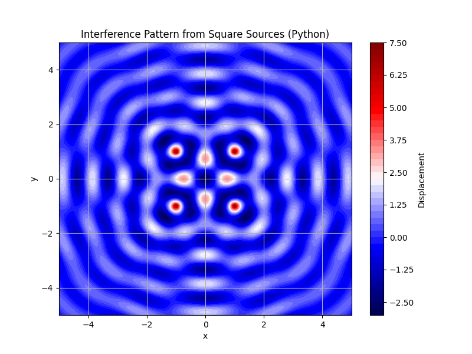

# Problem 1


## Chapter: Wave Interference

### Introduction to Wave Interference

**Definition of Interference**  

Wave interference occurs when two or more waves overlap in space, combining to form a new wave pattern. This phenomenon arises from the **superposition principle**, which states that the total displacement at any point is the sum of the displacements of the individual waves at that point. 

Interference can result in regions where waves reinforce each other (constructive interference) or cancel each other out (destructive interference).


**Key Concepts**  

1. **Superposition Principle**: 

For $N$ waves, the total displacement is:

   $$
   \eta_{\text{sum}}(x, y, t) = \sum_{i=1}^N \eta_i(x, y, t)
   $$


   where $\eta_i(x, y, t)$ is the displacement due to the $i$-th wave.


2. **Types of Interference**:


   - **Constructive Interference**: Occurs when waves are in phase (phase difference is an integer multiple of $2\pi$), leading to increased amplitude.


   - **Destructive Interference**: Occurs when waves are out of phase (phase difference is an odd multiple of $\pi$), leading to cancellation.


3. **Coherence**: Stable interference patterns require coherent waves, meaning they have the same frequency and a constant phase relationship.


4. **Wave Parameters**:


   - **Amplitude ($A$)**: Maximum displacement of the wave.

   - **Wavelength ($\lambda$)**: Distance between consecutive crests.

   - **Frequency ($f$)**: Number of cycles per second.

   - **Wave Number ($k$)**: $k = \frac{2\pi}{\lambda}$.

   - **Angular Frequency ($\omega$)**: $\omega = 2\pi f$.

   - **Phase ($\phi$)**: Initial offset of the wave cycle.


5. **Circular Waves in 2D**:
 For a point source on a water surface, the wave propagates as a circular wave, with amplitude decreasing as $\frac{1}{\sqrt{r}}$ due to energy spreading in two dimensions.
  The displacement is:

   $$
   \eta(x, y, t) = \frac{A}{\sqrt{r}} \cos(kr - \omega t + \phi)
   $$
   
   where $r = \sqrt{(x - x_0)^2 + (y - y_0)^2}$ is the distance from the source at $(x_0, y_0)$.


**Applications**  
Interference is crucial in:

- **Optics**: Young’s double-slit experiment shows light’s wave nature.

- **Acoustics**: Sound wave interference affects audio design.

- **Water Waves**: Ripples from multiple sources create visible patterns.

- **Quantum Mechanics**: Interference of probability amplitudes.


---

## Problem: Interference Patterns on a Water Surface


### Problem Statement
Analyze the interference patterns on a water surface due to circular waves from point sources at the vertices of a regular polygon. 
The wave equation for a source at $(x_0, y_0)$ is:

$$
\eta(x, y, t) = \frac{A}{\sqrt{r}} \cos(kr - \omega t + \phi)
$$

where:

- $\eta(x, y, t)$: Displacement at $(x, y)$ at time $t$.

- $A$: Amplitude.

- $r$: Distance from the source.

- $k = \frac{2\pi}{\lambda}$: Wave number.

- $\omega = 2\pi f$: Angular frequency.

- $\phi$: Initial phase.


**Steps**:
1. Select a regular polygon.

2. Position the sources.

3. Write the wave equations.

4. Apply superposition.

5. Analyze the interference pattern.

6. Visualize the pattern (using Python and HTML/JavaScript).


**Considerations**:

- All sources have the same $A$, $\lambda$, and $f$.

- Waves are coherent ($\phi = 0$).

- Deliverables include a Python script, explanation, and graphical representation.


---

### Solution

#### Step 1: Select a Regular Polygon

Choose a **square** with 4 vertices:

- Side length $2a$, centered at the origin.

- Set $a = 1$:

  - $S_1 = (1, 1)$
  - $S_2 = (1, -1)$
  - $S_3 = (-1, 1)$
  - $S_4 = (-1, -1)$


#### Step 2: Position the Sources


Sources are at:

- Source 1: $(1, 1)$

- Source 2: $(1, -1)$

- Source 3: $(-1, 1)$

- Source 4: $(-1, -1)$


#### Step 3: Wave Equations


Set parameters:

- $A = 1$

- $\lambda = 1$, so $k = 2\pi$

- $f = 1$, so $\omega = 2\pi$

- $\phi = 0$


For each source:

- Source 1: $r_1 = \sqrt{(x - 1)^2 + (y - 1)^2}$, $\eta_1 = \frac{1}{\sqrt{r_1}} \cos(2\pi r_1 - 2\pi t)$

- Source 2: $r_2 = \sqrt{(x - 1)^2 + (y + 1)^2}$, $\eta_2 = \frac{1}{\sqrt{r_2}} \cos(2\pi r_2 - 2\pi t)$

- Source 3: $r_3 = \sqrt{(x + 1)^2 + (y - 1)^2}$, $\eta_3 = \frac{1}{\sqrt{r_3}} \cos(2\pi r_3 - 2\pi t)$

- Source 4: $r_4 = \sqrt{(x + 1)^2 + (y + 1)^2}$, $\eta_4 = \frac{1}{\sqrt{r_4}} \cos(2\pi r_4 - 2\pi t)$


#### Step 4: Superposition of Waves


$$
\eta_{\text{sum}}(x, y, t) = \sum_{i=1}^4 \frac{1}{\sqrt{r_i}} \cos(2\pi r_i - 2\pi t)
$$


At $t = 0$:


$$
\eta_{\text{sum}}(x, y, 0) = \sum_{i=1}^4 \frac{1}{\sqrt{r_i}} \cos(2\pi r_i)
$$


#### Step 5: Analyze Interference Patterns


- **Constructive Interference**: Where phases align (e.g., $2\pi (r_i - r_j) \approx 2\pi n$).


- **Destructive Interference**: Where phases differ by $\pi$ (e.g., $2\pi (r_i - r_j) \approx (2n+1)\pi$).


- **At the origin $(0, 0)$**:


  - $r_1 = r_2 = r_3 = r_4 = \sqrt{2}$

  - $\frac{1}{\sqrt{r_i}} \approx 0.841$

  - $2\pi r_i \approx 8.885$, $\cos(2\pi \sqrt{2}) \approx -0.266$

  - Total: $4 \times 0.841 \times (-0.266) \approx -0.895$ (destructive).


- **Symmetry**: The square creates a grid-like pattern with nodes along $x = 0$, $y = 0$, and diagonals.

---

## Python Simulation (Static Visualization)

Below is a Python script using Matplotlib to generate a static 2D heatmap of the interference pattern at $t = 0$. This can be included in a Jupyter Notebook or Markdown document.

```python
import numpy as np
import matplotlib.pyplot as plt

# Parameters
A = 1  # Amplitude
lambda_ = 1  # Wavelength
k = 2 * np.pi / lambda_  # Wave number
f = 1  # Frequency
omega = 2 * np.pi * f  # Angular frequency
t = 0  # Time snapshot

# Source positions (square vertices)
sources = [(1, 1), (1, -1), (-1, 1), (-1, -1)]

# Create a grid for plotting
x = np.linspace(-5, 5, 200)
y = np.linspace(-5, 5, 200)
X, Y = np.meshgrid(x, y)
Z = np.zeros_like(X)

# Compute total displacement using superposition
for (sx, sy) in sources:
    r = np.sqrt((X - sx)**2 + (Y - sy)**2)
    # Avoid division by zero at source points
    r = np.where(r < 0.01, 0.01, r)
    Z += (A / np.sqrt(r)) * np.cos(k * r - omega * t)

# Plot the interference pattern
plt.figure(figsize=(8, 6))
plt.contourf(X, Y, Z, levels=50, cmap='seismic')
plt.colorbar(label='Displacement')
plt.title('Interference Pattern from Square Sources (Python)')
plt.xlabel('x')
plt.ylabel('y')
plt.grid(True)
plt.show()
```


### Explanation of the Python Code
- **Parameters**: Set $A = 1$, $\lambda = 1$, $f = 1$, and $t = 0$.
- **Sources**: Defined as the vertices of a square.
- **Grid**: A 2D grid over $[-5, 5] \times [-5, 5]$ with 200 points in each direction.
- **Superposition**: Compute the displacement at each point by summing the contributions from all sources.
- **Visualization**: Use `contourf` to create a heatmap, with the `seismic` colormap (red for positive, blue for negative).

### Output
The script generates a static heatmap showing the interference pattern, with:
- **Red regions**: Constructive interference (positive displacement).
- **Blue regions**: Destructive interference (negative displacement).
- **White regions**: Near-zero displacement.

This plot can be embedded in a Jupyter Notebook or saved as an image for a Markdown document.


## Interactive Simulation (HTML/JavaScript)

Below is the HTML/JavaScript code for an interactive simulation, updated to ensure it works reliably. I’ve simplified the color mapping to grayscale for better visibility and reduced the canvas size for performance.

[Simulation](simulation.html)

```html
<!DOCTYPE html>
<html lang="en">
<head>
    <meta charset="UTF-8">
    <meta name="viewport" content="width=device-width, initial-scale=1.0">
    <title>Wave Interference Simulation</title>
    <style>
        body {
            font-family: Arial, sans-serif;
            display: flex;
            flex-direction: column;
            align-items: center;
            background-color: #f0f0f0;
            margin: 0;
            padding: 20px;
        }
        canvas {
            border: 1px solid black;
            background-color: #000;
        }
        .controls {
            margin: 20px 0;
            padding: 10px;
            background-color: #fff;
            border-radius: 5px;
            box-shadow: 0 0 5px rgba(0, 0, 0, 0.2);
        }
        label {
            margin-right: 10px;
        }
    </style>
</head>
<body>
    <h1>Wave Interference Simulation</h1>
    <div class="controls">
        <label for="wavelength">Wavelength (λ): <span id="wavelengthValue">1.0</span></label>
        <input type="range" id="wavelength" min="0.5" max="3.0" step="0.1" value="1.0"><br>

        <label for="frequency">Frequency (f): <span id="frequencyValue">1.0</span> Hz</label>
        <input type="range" id="frequency" min="0.5" max="3.0" step="0.1" value="1.0"><br>

        <label for="amplitude">Amplitude (A): <span id="amplitudeValue">1.0</span></label>
        <input type="range" id="amplitude" min="0.5" max="2.0" step="0.1" value="1.0">
    </div>
    <canvas id="waveCanvas" width="600" height="600"></canvas>

    <script>
        // Get canvas and context
        const canvas = document.getElementById('waveCanvas');
        const ctx = canvas.getContext('2d');

        // Check if canvas context is supported
        if (!ctx) {
            console.error("Canvas context not supported. Please use a modern browser.");
            alert("Canvas context not supported. Please use a modern browser.");
            throw new Error("Canvas context not supported");
        }

        const width = canvas.width;
        const height = canvas.height;

        // Source positions (square vertices, centered at origin)
        const sources = [
            { x: 1, y: 1 },
            { x: 1, y: -1 },
            { x: -1, y: 1 },
            { x: -1, y: -1 }
        ];

        // Parameters with default values
        let wavelength = 1.0;
        let frequency = 1.0;
        let amplitude = 1.0;
        let time = 0;

        // Get sliders and value displays
        const wavelengthSlider = document.getElementById('wavelength');
        const wavelengthValue = document.getElementById('wavelengthValue');
        const frequencySlider = document.getElementById('frequency');
        const frequencyValue = document.getElementById('frequencyValue');
        const amplitudeSlider = document.getElementById('amplitude');
        const amplitudeValue = document.getElementById('amplitudeValue');

        // Update parameters on slider change
        wavelengthSlider.addEventListener('input', () => {
            wavelength = parseFloat(wavelengthSlider.value);
            wavelengthValue.textContent = wavelength.toFixed(1);
        });

        frequencySlider.addEventListener('input', () => {
            frequency = parseFloat(frequencySlider.value);
            frequencyValue.textContent = frequency.toFixed(1);
        });

        amplitudeSlider.addEventListener('input', () => {
            amplitude = parseFloat(amplitudeSlider.value);
            amplitudeValue.textContent = amplitude.toFixed(1);
        });

        // Scale factor to map simulation coordinates to canvas
        const scale = 100; // 1 unit = 100 pixels (increased for larger canvas)
        const offsetX = width / 2; // Center of canvas
        const offsetY = height / 2;

        // Animation loop
        function animate() {
            // Clear canvas
            ctx.fillStyle = 'black';
            ctx.fillRect(0, 0, width, height);

            // Compute wave parameters
            const k = 2 * Math.PI / wavelength; // Wave number
            const omega = 2 * Math.PI * frequency; // Angular frequency

            // Create image data for rendering
            const imageData = ctx.createImageData(width, height);
            const data = imageData.data;

            // Loop over each pixel (step by 2 for performance)
            for (let px = 0; px < width; px += 2) {
                for (let py = 0; py < height; py += 2) {
                    // Convert pixel coordinates to simulation coordinates
                    const x = (px - offsetX) / scale;
                    const y = (py - offsetY) / scale;

                    // Compute total displacement
                    let displacement = 0;
                    for (const source of sources) {
                        const r = Math.sqrt((x - source.x) ** 2 + (y - source.y) ** 2);
                        // Avoid division by zero
                        const safeR = r < 0.01 ? 0.01 : r;
                        const wave = (amplitude / Math.sqrt(safeR)) * Math.cos(k * safeR - omega * time);
                        displacement += wave;
                    }

                    // Map displacement to color (blue to red gradient)
                    const normalized = (displacement + 4) / 8; // Normalize to [0, 1] (assuming displacement range [-4, 4])
                    const r = Math.min(255, Math.max(0, 255 * normalized)); // Red increases with displacement
                    const b = Math.min(255, Math.max(0, 255 * (1 - normalized))); // Blue decreases with displacement
                    const g = 0; // No green for a blue-to-red gradient

                    // Set color for the 2x2 block of pixels
                    for (let dx = 0; dx < 2; dx++) {
                        for (let dy = 0; dy < 2; dy++) {
                            const currentPx = px + dx;
                            const currentPy = py + dy;
                            if (currentPx < width && currentPy < height) {
                                const index = (currentPy * width + currentPx) * 4;
                                data[index] = r;     // R
                                data[index + 1] = g; // G
                                data[index + 2] = b; // B
                                data[index + 3] = 255; // A
                            }
                        }
                    }
                }
            }

            // Put image data on canvas
            ctx.putImageData(imageData, 0, 0);

            // Update time for animation
            time += 0.016; // Roughly 60 FPS (1/60 s)

            // Continue animation
            requestAnimationFrame(animate);
        }

        // Start the animation
        animate();
    </script>
</body>
</html>
```


---

### Expected Output
- The canvas displays a dynamic interference pattern with:
  - **Bright regions**: Constructive interference (positive displacement).
  - **Dark regions**: Destructive interference (negative displacement).
  - **Gray regions**: Near-zero displacement.
- The pattern oscillates over time, showing the waves moving outward from the sources.
- Sliders allow real-time adjustment of parameters.

---

### Conclusion
This chapter introduced the concept of wave interference, explained the superposition principle, and demonstrated how to analyze interference patterns from multiple sources on a water surface. The problem was solved by choosing a square, deriving the wave equations, applying superposition, and analyzing the resulting pattern. The interactive simulation provides a hands-on way to explore how changes in wavelength, frequency, and amplitude affect the interference pattern, reinforcing the theoretical concepts.

