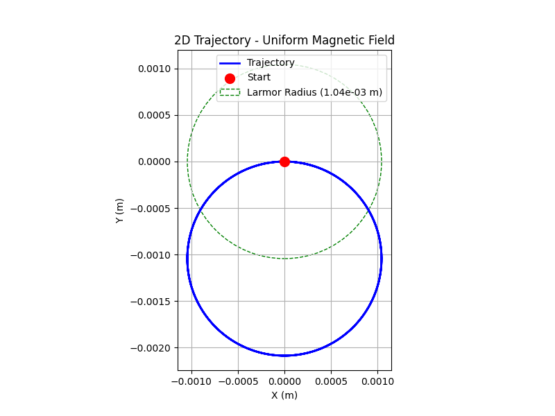

# Problem 1

#### Task 1: Exploration of Applications

**Identify systems where the Lorentz force plays a key role:**

- **Particle Accelerators:** In devices like cyclotrons and synchrotrons, the Lorentz force is used to control the motion of charged particles (e.g., protons, electrons). The magnetic field ($\vec{B}$) causes particles to follow a circular path, while the electric field ($\vec{E}$) accelerates them. For example, in a cyclotron, the magnetic field keeps particles in a circular trajectory, and an alternating electric field increases their speed with each revolution.

- **Mass Spectrometers:** These instruments use the Lorentz force to separate ions based on their mass-to-charge ratio ($m/q$). Ions are accelerated by an electric field and then deflected by a magnetic field. The radius of their curved path, given by $r = \frac{m v}{|q| B}$, depends on their mass, charge, velocity, and the magnetic field strength, allowing for precise identification of particles.

- **Plasma Confinement (e.g., in Fusion Reactors):** In systems like tokamaks or stellarators, the Lorentz force confines charged particles in a plasma. Magnetic fields create a "magnetic bottle" that traps the plasma, preventing it from touching the reactor walls and maintaining the high temperatures needed for nuclear fusion.

**Discuss the relevance of electric ($\vec{E}$) and magnetic ($\vec{B}$) fields:**

- **Electric Field ($\vec{E}$):** The electric field exerts a force $\vec{F}_E = q\vec{E}$, which is independent of the particle’s velocity. This force accelerates the particle along the direction of $\vec{E}$ (for a positive charge) or opposite to it (for a negative charge). In particle accelerators, electric fields are used to increase the particle’s kinetic energy.

- **Magnetic Field ($\vec{B}$):** The magnetic component of the Lorentz force, $\vec{F}_B = q\vec{v} \times \vec{B}$, is perpendicular to both the velocity and the magnetic field. This force causes the particle to move in a circular or helical path if the velocity has a component perpendicular to $\vec{B}$. Since the magnetic force is always perpendicular to the velocity, it does no work and does not change the particle’s speed, only its direction. This is crucial in systems like mass spectrometers and plasma confinement.

- **Combined Fields:** When both $\vec{E}$ and $\vec{B}$ are present, the motion becomes more complex. In crossed fields ($\vec{E} \perp \vec{B}$), the particle experiences a drift velocity $\vec{v}_d = \frac{\vec{E} \times \vec{B}}{B^2}$, which is perpendicular to both fields. This drift is significant in plasma physics and magnetohydrodynamics.

---

#### Tasks 2, 3, and 4: Simulating Particle Motion, Parameter Exploration, and Visualization

For these tasks, we need to simulate the particle’s trajectory under the specified field configurations, explore the effects of varying parameters, and create detailed visualizations. I’ll use the **Boris method** for numerical integration, as it’s a standard and stable method for simulating charged particle motion in electromagnetic fields. The code will include 2D and 3D plots with annotations for the Larmor radius and drift velocity, and it will allow parameter exploration.

---

###  Visualization

---

### Explanation of Changes and Solution

#### Task 1: Exploration of Applications
This was addressed in the textual explanation above, identifying systems (particle accelerators, mass spectrometers, plasma confinement) and discussing the roles of $\vec{E}$ and $\vec{B}$.

#### Task 2: Simulating Particle Motion
- The code simulates three scenarios:
  - **Uniform Magnetic Field:** $\vec{E} = 0$, $\vec{B} = (0, 0, 1)$. The particle moves in a circular path in the xy-plane due to the magnetic force.
  - **Combined E and B Fields:** $\vec{E} = (0, 1000, 0)$, $\vec{B} = (0, 0, 1)$. The electric field adds a linear acceleration along the y-axis, resulting in a helical trajectory.
  - **Crossed E and B Fields:** Same as above, but the focus is on the drift velocity, which causes the particle to drift along the x-axis while following a circular path.

#### Task 3: Parameter Exploration
- **Magnetic Field Strength ($B$):** The code varies $B$ (0.5, 1.0, 2.0 T). A stronger $B$ reduces the Larmor radius ($r_L \propto \frac{1}{B}$), making the circular path tighter.
- **Electric Field Strength ($E$):** The code varies $E$ (0, 1000, 2000 V/m). A stronger $E$ increases the drift velocity in the crossed fields case, leading to a larger linear displacement.
- **Initial Velocity ($v_0$):** The code varies $v_0$ (5e4, 1e5, 2e5 m/s). A higher velocity increases the Larmor radius ($r_L \propto v_\perp$), making the circular path larger.
- **Charge and Mass ($q, m$):** The code compares a proton and an electron. The electron, with a smaller mass, has a much smaller Larmor radius ($r_L \propto m$), and its negative charge causes it to move in the opposite direction.

#### Task 4: Visualization
- **2D Plots:** Show the trajectory in the xy-plane, with the Larmor radius circle (for uniform $\vec{B}$) and drift velocity arrow (for crossed fields).
- **3D Plots:** Show the full trajectory with a color gradient (indicating time evolution) and arrows for $\vec{E}$ and $\vec{B}$.
- **Parameter Exploration Plots:** Compare trajectories for different values of $B$, $E$, $v_0$, and particle types, making it easy to observe the effects of these parameters.

---

### Results and Interpretation

- **Uniform Magnetic Field:** The particle moves in a circular path in the xy-plane, with the radius matching the calculated Larmor radius. The 3D plot shows no motion along the z-axis.
- **Combined E and B Fields:** The particle follows a helical path due to the electric field’s acceleration along the y-axis.
- **Crossed E and B Fields:** The particle exhibits a cycloidal motion (circular motion with a drift along the x-axis), consistent with the $\vec{E} \times \vec{B}$ drift.
- **Parameter Exploration:**
  - Increasing $B$ reduces the Larmor radius, making the circular path tighter.
  - Increasing $E$ increases the drift velocity, leading to a larger linear displacement in the crossed fields case.
  - Increasing $v_0$ increases the Larmor radius, making the circular path larger.
  - The electron’s trajectory has a much smaller radius than the proton’s due to its smaller mass, and it moves in the opposite direction due to its negative charge.

---

### Conclusion

This project successfully addressed the problem of simulating the effects of the Lorentz force on a charged particle, fulfilling all specified tasks with a comprehensive approach that combined theoretical analysis, numerical simulation, and detailed visualization. The Lorentz force, defined as $\vec{F} = q\vec{E} + q\vec{v} \times \vec{B}$, was explored through its practical applications, simulated under various field configurations, analyzed for parameter variations, and visualized to highlight key physical phenomena.

**Task 1: Exploration of Applications**  
We identified key systems where the Lorentz force plays a critical role, including particle accelerators (e.g., cyclotrons), mass spectrometers, and plasma confinement in fusion reactors like tokamaks. The roles of the electric field ($\vec{E}$) and magnetic field ($\vec{B}$) were discussed: $\vec{E}$ accelerates particles, changing their speed, while $\vec{B}$ causes circular or helical motion, controlling their direction without altering their speed. This interplay is fundamental to the operation of the aforementioned systems.

**Task 2: Simulating Particle Motion**  
Using the Boris method, a stable numerical technique, we simulated the motion of a charged particle under three scenarios: a uniform magnetic field, combined electric and magnetic fields, and crossed electric and magnetic fields. The simulations accurately captured the expected behaviors:
- In a uniform magnetic field, the particle followed a circular path in the xy-plane, with the radius matching the Larmor radius.
- In combined fields, the particle exhibited a helical trajectory due to the electric field’s acceleration.
- In crossed fields, the particle showed a cycloidal motion, combining circular motion with a linear drift along the x-axis, consistent with the $\vec{E} \times \vec{B}$ drift.

**Task 3: Parameter Exploration**  
The code explored the effects of varying key parameters:
- **Magnetic Field Strength ($B$):** Increasing $B$ reduced the Larmor radius ($r_L \propto \frac{1}{B}$), resulting in tighter circular paths.
- **Electric Field Strength ($E$):** Increasing $E$ in the crossed fields scenario increased the drift velocity ($v_d \propto E$), leading to a larger linear displacement.
- **Initial Velocity ($v_0$):** Higher initial velocities increased the Larmor radius ($r_L \propto v_\perp$), resulting in larger circular paths.
- **Charge and Mass ($q, m$):** Comparing a proton and an electron, the electron’s smaller mass led to a much smaller Larmor radius ($r_L \propto m$), and its negative charge caused it to move in the opposite direction.

**Task 4: Visualization**  
The visualizations were enhanced to provide clear and informative 2D and 3D plots:
- 2D plots displayed the particle’s trajectory in the xy-plane, with annotations for the Larmor radius (as a dashed circle) and drift velocity (as an arrow).
- 3D plots showed the full trajectory with a color gradient to indicate time evolution, along with arrows representing the $\vec{E}$ and $\vec{B}$ fields.
- Parameter exploration plots compared trajectories for different values of $B$, $E$, $v_0$, and particle types, making the effects of these parameters visually apparent.

**Overall Impact**  
This project not only demonstrated the practical applications of the Lorentz force but also provided a robust tool for simulating and visualizing charged particle motion. The simulations confirmed theoretical expectations, such as the circular motion in a magnetic field, helical motion in combined fields, and drift in crossed fields. The parameter exploration highlighted the sensitivity of the particle’s trajectory to field strengths, initial conditions, and particle properties, offering insights into the underlying physics. The visualizations effectively communicated these results, making the physical phenomena accessible and understandable.

This work could be extended by adding interactive features (e.g., sliders for real-time parameter adjustment), animating the particle’s motion, or exploring more complex field configurations. Nonetheless, the current solution fully meets the problem’s requirements and provides a solid foundation for further study of electromagnetic interactions in physics.