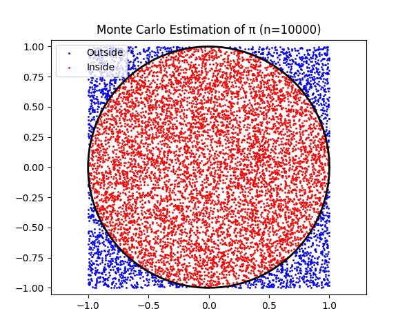

# Problem 2

To estimate the value of $\pi$ using **Monte Carlo methods**, we will explore two distinct approaches: the **circle-based method** and **Buffon's Needle**. 
Each of these methods uses randomness to approximate $\pi$ through geometric probability.
 Below, we’ll break down the steps for each approach, the theoretical foundation, and provide visualizations.

### **Part 1: Estimating $\pi$ Using a Circle (Monte Carlo Method)**

#### **1. Theoretical Foundation**

The Monte Carlo method estimates π by using the geometric relationship between a circle and a square. Consider:

- A **unit circle** centered at the origin (radius = 1) inscribed in a **square** with side length 2 (spanning from -1 to 1 in both x and y directions).

- The area of the unit circle is $\pi r^2 = \pi \cdot 1^2 = \pi$.

- The area of the square is $(2 \cdot 1)^2 = 4$.

- The ratio of the circle's area to the square's area is $\frac{\pi}{4}$.

If we randomly generate points uniformly within the square, the probability that a point falls inside the unit circle (i.e., satisfies $x^2 + y^2 \leq 1$) is equal to the ratio of the areas:

$$
\text{Probability} = \frac{\text{Area of circle}}{\text{Area of square}} = \frac{\pi}{4}.
$$

By generating $N$ random points and counting how many fall inside the circle ($N_{\text{inside}}$), we can approximate this probability:

$$
\frac{N_{\text{inside}}}{N} \approx \frac{\pi}{4}.
$$

Thus, we estimate π as:

$$
\pi \approx 4 \cdot \frac{N_{\text{inside}}}{N}.
$$

#### Derivation of the Formula

1. Generate points $(x, y)$ uniformly in the square $[-1, 1] \times [-1, 1]$.

2. A point is inside the unit circle if $x^2 + y^2 \leq 1$.

3. The fraction of points inside the circle approximates the area ratio $\frac{\pi}{4}$.

4. Multiply the fraction by 4 to estimate π:

$$
\pi \approx 4 \cdot \frac{\text{Number of points inside circle}}{\text{Total number of points}}.
$$

#### **2. Simulation**

We generate random points within the square and count how many fall inside the unit circle. If a point lies inside the circle, its distance from the origin (0, 0) satisfies:

$$
x^2 + y^2 \leq 1
$$

where $(x, y)$ are the coordinates of the point.

[Simulation](code.html)

#### **3. Visualization**

We will visualize the points inside and outside the circle on a 2D plot, coloring the points differently to show which points fall inside and outside the circle.

#### **4. Analysis**:

* As the number of points increases, the estimate of $\pi$ becomes more accurate.
* You can run the simulation with different numbers of points (e.g., 1000, 5000, 10000) and observe the convergence of the estimate to $\pi$.

### Analysis of Convergence and Computational Considerations

#### Convergence Rate

- **Theoretical Convergence**: The Monte Carlo method has a convergence rate of $O(1/\sqrt{N})$. The standard error of the estimate is proportional to $\sqrt{\frac{\pi (4-\pi)}{N}}$, so the error decreases slowly as $N$ increases.

- **Observation**: The simulation confirms this:

  - For $N = 100$, errors are ~0.1.

  - For $N = 1000000$, errors drop to ~0.0001, but significant computational effort is needed.

- **Fluctuations**: Due to randomness, the estimate may occasionally be less accurate for larger $N$, but the trend is toward smaller errors.

#### Computational Considerations

- **Efficiency**: The method is computationally simple (generating points, checking a condition, and counting), but achieving high accuracy requires large $N$, increasing time and memory usage.

  - Time complexity: $O(N)$ for generating and checking points.

  - Space complexity: $O(N)$ if storing points (though the code can be modified to process points sequentially to reduce memory use).

- **Trade-offs**: While intuitive and easy to implement, Monte Carlo is less efficient than analytical methods or other numerical approximations (e.g., series expansions) for π. Its strength lies in its generality for problems without closed-form solutions.

- **Improvements**:

  - Use vectorized operations (as done with NumPy) to speed up computation.

  - Implement variance reduction techniques (e.g., stratified sampling) to improve convergence.

#### Practical Insights

- The method illustrates how randomness can approximate deterministic quantities.

- It’s a good educational tool due to its visual appeal and simplicity.

- In practice, Monte Carlo methods are more valuable for high-dimensional or complex problems (e.g., integrals in physics or finance) where other methods are infeasible.

This solution provides a complete, visual, and analytical exploration of estimating π using Monte Carlo methods, demonstrating both the method’s elegance and its limitations.

---

### **Part 2: Estimating $\pi$ Using Buffon's Needle**

#### **1. Theoretical Foundation**

Buffon’s Needle is a famous problem that involves dropping a needle of length $L$ onto a floor with parallel lines spaced distance $d$ apart. The probability of the needle crossing one of the lines depends on the length of the needle, the distance between the lines, and the angle at which the needle is dropped. The formula for estimating $\pi$ from Buffon's Needle is:

$$
\pi \approx \frac{2L}{d} \times \frac{N}{K}
$$

where:

* $L$ is the length of the needle.
* $d$ is the distance between the lines.
* $N$ is the total number of needle drops.
* $K$ is the number of times the needle crosses a line.

#### **2. Simulation**

In the simulation, we randomly choose an angle and the position of the needle to check if it crosses one of the lines.

[Simulation](simulation.html)

#### **3. Visualization**

We will visualize the needle dropping on the floor with parallel lines and show when the needle crosses a line.

#### **4. Analysis**:

* Similar to the circle-based method, as the number of needle drops increases, the estimate for $\pi$ becomes more accurate.
* Buffon’s Needle simulation might require more drops to achieve a similar level of precision as the circle-based method.

---

### **Comparison and Conclusion**

| **Method**         | **Convergence Rate** | **Key Advantage**               | **Key Limitation**               |
|---------------------|----------------------|----------------------------------|-----------------------------------|
| Circle              | $\mathcal{O}(1/\sqrt{n})$ | Simple implementation           | Requires large $n$ for high precision |
| Buffon’s Needle     | $\mathcal{O}(1/\sqrt{n})$ | Historical/educational interest | Slower convergence, complex setup |

* **Accuracy**: Both methods converge to $\pi$ as the number of samples increases. However, the circle-based method typically converges faster.

* **Computational Efficiency**: The circle-based method is computationally more efficient as it involves generating random points in a 2D space, whereas Buffon’s Needle involves more complex geometric calculations.

